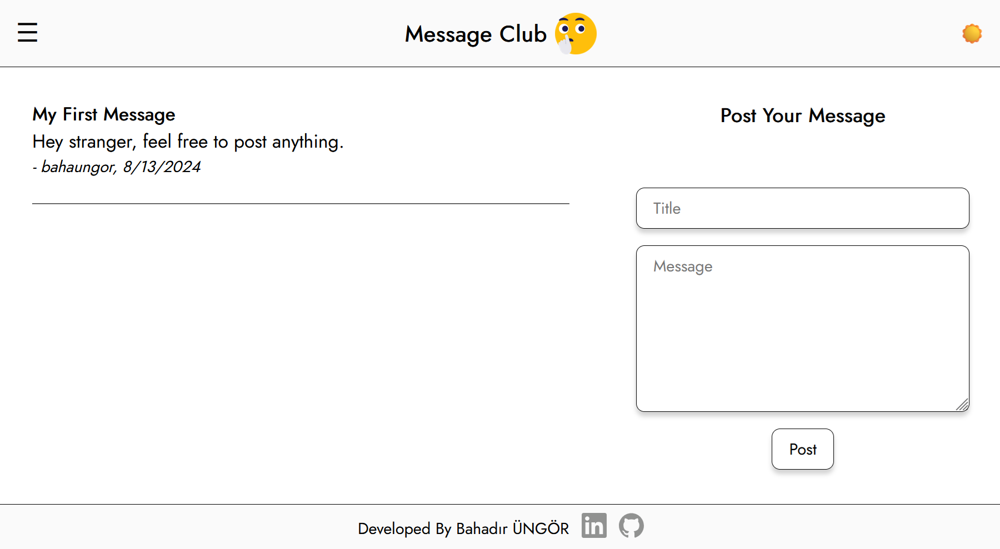

# Secret Message Club

Members-only message board app where you log in anonymously to share your thoughts and connect with others

Link to the website → [**Secret Message Club**](https://message-club.vercel.app/)

# Table Of Content

- [Introduction](#introduction)
- [Languages and Tools](#languages-and-tools)
- [Credits](#credits)

# Introduction

This is members-only message club where you log in anonymously to share your thoughts and connect with others. Post messages without revealing your identity and see what others have to say — all in a safe and welcoming space.

**NOT:** This web application made for Odin Projects as a part of Full Stack Web Development curriculum.

# Languages and Tools

# Credits

Bahadir Ungor | Artificial Intelligence Engineer @ 

